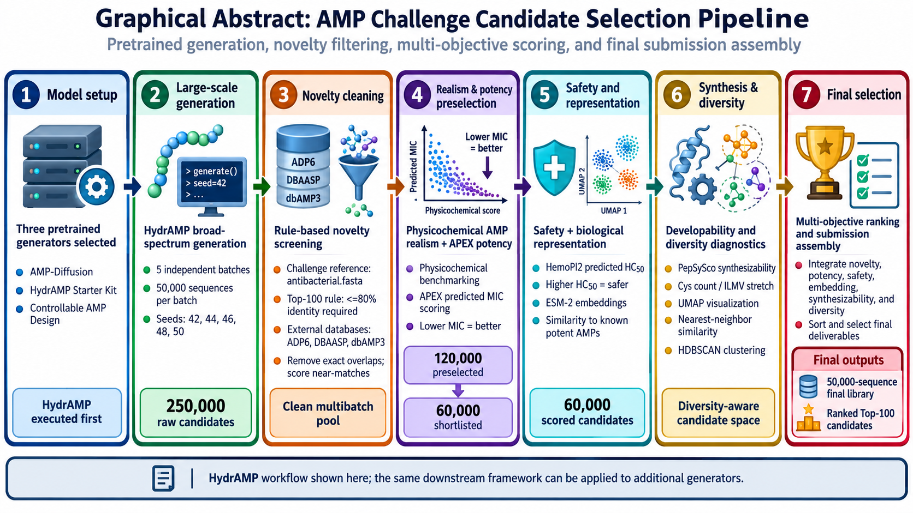

# PersiPep — AMP Challenge 2027


**PersiPep** is a submission to the  
**AMP Challenge — International Competition for Generative AI in Antimicrobial Peptide Design**.

PersiPep combines large-scale antimicrobial peptide generation with sequence cleaning, novelty assessment, physicochemical screening, predicted antimicrobial potency, safety assessment, biological representation, synthesizability analysis, diversity assessment, and multi-objective final ranking.

---

## Graphical Abstract

<p align="center">
  
</p>

---

## Team

All individuals listed below are members of the **PersiPep team**.  
Role labels indicate project responsibilities only.

| Name | Role |
|---|---|
| **Fereshteh Noroozi Tiyoula** | Team Member |
| **Marzieh Gholami** | Team Member |
| **Kaveh Kavousi** | Academic Supervisor |
| **Shohre Ariaeenejad** | Academic Supervisor |

---

## Overview

The PersiPep workflow was designed as a multi-stage peptide generation and candidate-selection pipeline.

The final production peptide pool was generated using the pretrained **HydrAMP** model.

Five independent HydrAMP generation batches were initiated using the fixed starting seeds:

```text
42, 44, 46, 48, 50
```

Each batch targeted 50,000 peptide sequences, resulting in an initial production pool of:

```text
250,000 raw peptide candidates
```

The generated sequences were subsequently processed through:

1. sequence cleaning and competition-reference filtering;
2. external AMP novelty assessment;
3. physicochemical realism scoring;
4. APEX antimicrobial potency prediction;
5. potency-informed preselection;
6. HemoPI2 hemolytic-safety prediction;
7. ESM-2 biological representation analysis;
8. PepSySco synthesizability scoring;
9. diversity assessment;
10. multi-objective final ranking and Top-100 selection.

The final challenge-facing outputs are:

```text
generate/library.fasta
generate/top.fasta
```

containing:

- **50,000 unique designed AMP sequences**
- **100 ranked candidate peptides**

---

## Repository Structure

```text
PersiPep-AMP-Challenge-2027/
│
├── artifacts/
│   └── pepsysco/
│       ├── result.csv
│       └── README.md
│
├── checkpoint/
│   ├── model/
│   ├── pca_decomposer.joblib
│   └── README.md
│
├── data/
│   ├── antibacterial.fasta
│   └── README.md
│
├── docs/
│   └── project report
│
├── generate/
│   ├── library.fasta
│   └── top.fasta
│
├── notebooks/
│   ├── 00_cleaning/
│   ├── 01_external_novelty/
│   ├── 02_physchem_and_preselection/
│   ├── 03_apex_preselection/
│   ├── 04_esm2_embeddings/
│   ├── 05_synthesizability/
│   ├── 06_diversity/
│   └── 07_final_selection/
│
├── scripts/
│   ├── apex/
│   │   └── run_apex_120k.py
│   ├── hemopi2/
│   │   └── run_hemopi2_60k.py
│   └── pipeline/
│       ├── 01_cleaning.py
│       ├── 02_external_novelty.py
│       ├── 03_physchem_preselection.py
│       ├── 04_apex_preselection.py
│       ├── 05_esm2_embedding_extraction.py
│       ├── 06_biological_embedding_scoring.py
│       ├── 07_pepsysco_synthesizability.py
│       ├── 08_diversity_assessment.py
│       ├── 09_final_selection.py
│       ├── _notebook_runner.py
│       └── README.md
│
├── src/
│   └── persipep_amp_challenge/
│       ├── __init__.py
│       └── generate.py
│
├── graphical_abstract.png
├── .gitignore
├── .python-version
├── LICENSE
├── README.md
├── REPRODUCIBILITY.md
└── pyproject.toml
```


---

# Scientific Workflow

The PersiPep workflow was originally executed across both a university compute server and Google Colab.

This multi-environment design reflects the different software, dependency, CPU, and GPU requirements of the individual components.

The complete execution order is:

```text
HydrAMP generation
        ↓
Sequence cleaning
        ↓
External AMP novelty scoring
        ↓
Physicochemical assessment
        ↓
120K preselection
        ↓
APEX potency prediction
        ↓
60K preselection
        ↓
HemoPI2 safety prediction
        ↓
ESM-2 embedding extraction
        ↓
Biological embedding scoring
        ↓
PepSySco synthesizability
        ↓
Diversity assessment
        ↓
Final multi-objective ranking
        ↓
50K library + ranked Top-100
```

Exact environment information, commands, file mappings, seeds, and stage-specific execution instructions are provided in:

[REPRODUCIBILITY.md](REPRODUCIBILITY.md)

---

# 1. HydrAMP Generation

The production peptide pool was generated using the pretrained **HydrAMP** model.

Upstream starter kit:

```text
https://github.com/szczurek-lab/hydramp-starter-kit
```

Starter-kit revision used:

```text
7804df862872ccc6d09fe01c41bafbca194cfa31
```

HydrAMP source revision:

```text
6590d2f4c2963f25d30669052a4c4a857e0e7279
```

The pretrained HydrAMP checkpoint used for generation is included under:

```text
checkpoint/
```

Five independent production batches were generated using the starting seeds:

```text
42
44
46
48
50
```

Each batch targeted 50,000 peptide sequences.

Total raw production pool:

```text
250,000 sequences
```

Generation commands and the original HydrAMP execution environment are documented in:

[REPRODUCIBILITY.md](REPRODUCIBILITY.md)

---

# 2. Sequence Cleaning and Reference Filtering

Notebook:

```text
notebooks/00_cleaning/AMP_Challenge_MultiBatch_Clean_Pool_Builder.ipynb
```

This stage performs:

- standard amino-acid alphabet validation;
- sequence-length validation;
- duplicate removal;
- comparison with the official competition antibacterial reference;
- exact-match filtering against known AMP resources;
- near-match screening.

The official competition antibacterial reference is included as:

```text
data/antibacterial.fasta
```

External AMP resources used for screening included:

- APD6
- DBAASP
- dbAMP3

External database files are not redistributed in this repository where redistribution conditions are uncertain.

Database provenance and preparation information are documented in:

```text
data/README.md
```

Candidate counts:

```text
250,000 raw candidates
        ↓
246,795 retained candidates
```

Primary cleaned output:

```text
MULTIBATCH_5__filtered_against__ADP6__DBAASP__antibacterial__dbAMP3__ALL_CLEAN.csv
```

---

# 3. External AMP Novelty Scoring

Notebook:

```text
notebooks/01_external_novelty/01_external_known_amp_nearmatch_scoring.ipynb
```

This stage evaluates sequence similarity between generated peptides and known AMP sequences from the external reference resources.

Primary output:

```text
ALL_CLEAN_WITH_EXTERNAL_NEARMATCH.csv
```

The external near-match score was retained as a downstream candidate-ranking feature.

---

# 4. Physicochemical Realism and 120K Preselection

Notebook:

```text
notebooks/02_physchem_and_preselection/02_physicochemical_realism_and_120k_preselection.ipynb
```

This stage evaluates physicochemical characteristics and combines information from:

- physicochemical realism;
- literature-informed AMP characteristics;
- sequence novelty;
- external AMP similarity.

The candidate pool was reduced to:

```text
120,000 candidates
```

with balanced representation from the five HydrAMP generation batches.

Primary output:

```text
STEP5B_PRESELECTED_120K.csv
```

---

# 5. APEX Antimicrobial Potency Prediction

APEX was used to predict antimicrobial potency.

Execution wrapper:

```text
scripts/apex/run_apex_120k.py
```

Input:

```text
STEP5B_PRESELECTED_120K.csv
```

Number of evaluated candidates:

```text
120,000
```

Lower predicted MIC values were treated as more favorable.

The production server run used five CPU threads.

Example thread configuration:

```bash
export OMP_NUM_THREADS=5
export MKL_NUM_THREADS=5
export OPENBLAS_NUM_THREADS=5
export NUMEXPR_NUM_THREADS=5
```

Primary output:

```text
STEP7_120K_WITH_APEX_POTENCY.csv
```

The exact production command and environment are recorded in `REPRODUCIBILITY.md`.

---

# 6. APEX-Informed 60K Preselection

Notebook:

```text
notebooks/03_apex_preselection/03_apex_informed_preselection_120k_to_60k.ipynb
```

The 120,000 candidates were prioritized using complementary information from:

- APEX predicted potency;
- physicochemical realism;
- novelty;
- external AMP similarity.

The candidate pool was reduced to:

```text
60,000 candidates
```

Primary output:

```text
STEP7B_PRESELECTED_60K.csv
```

---

# 7. HemoPI2 Safety Prediction

HemoPI2 was used to estimate hemolytic safety through predicted HC50.

Execution wrapper:

```text
scripts/hemopi2/run_hemopi2_60k.py
```

Input:

```text
STEP7B_PRESELECTED_60K.csv
```

Number of evaluated candidates:

```text
60,000
```

Higher predicted HC50 values were treated as more favorable.

The production server run used five CPU threads.

Example thread configuration:

```bash
export OMP_NUM_THREADS=5
export MKL_NUM_THREADS=5
export OPENBLAS_NUM_THREADS=5
export NUMEXPR_NUM_THREADS=5
```

Primary output:

```text
STEP8_60K_WITH_HEMOPI2_HC50.csv
```

The exact production command and environment are recorded in `REPRODUCIBILITY.md`.

---

# 8. ESM-2 Embedding Extraction

Notebook:

```text
notebooks/04_esm2_embeddings/04a_esm2_embedding_extraction_60k.ipynb
```

The 60,000 shortlisted peptides were represented using **ESM-2**.

The main embedding model used for candidate representation was:

```text
ESM-2 35M
12 layers
480-dimensional embeddings
```

Primary output:

```text
STEP9_ESM2_35M_EMBEDDINGS_60K.npz
```

---

# 9. Biological Embedding Scoring

Notebook:

```text
notebooks/04_esm2_embeddings/04b_biological_embedding_scoring.ipynb
```

ESM-2 representations were used to compare generated candidates with a potent AMP reference set.

Primary output:

```text
STEP9B_60K_WITH_BIOLOGICAL_EMBEDDING_SCORES.csv
```

---

# 10. Synthesizability Assessment

Notebook:

```text
notebooks/05_synthesizability/05_pepsysco_synthesizability.ipynb
```

Pipeline implementation:

```text
scripts/pipeline/07_pepsysco_synthesizability.py
```

PepSySco was used to assess peptide synthesizability.

All 60,000 candidates were within the validated 8–25 residue length domain used for this stage.

The notebook exported the peptide sequences as:

```text
STEP10_PEPSYSCO_INPUT_8_25.txt
```

The exported sequences were submitted to the external PepSySco web service. The exact returned result used in the PersiPep workflow is preserved in this repository as:

```text
artifacts/pepsysco/result.csv
```

The preserved web-service output contains the columns:

```text
peptide
score
```

This fixed artifact is used by the downstream PersiPep workflow to merge PepSySco synthesizability scores back onto the 60,000-candidate dataset.

Because PepSySco inference was performed through an external web service rather than through a locally executed model, the original web-service result is retained as a reproducibility artifact. Its provenance and role in the workflow are documented in:

```text
artifacts/pepsysco/README.md
```

Primary merged output:

```text
STEP10_60K_WITH_PEPSYSCO_SYNTHESIZABILITY.csv
```


---

# 11. Diversity Assessment

Notebook:

```text
notebooks/06_diversity/06_diversity_clustering_assessment.ipynb
```

Candidate diversity was evaluated using complementary analyses including:

- ESM-2 embedding space;
- nearest-neighbor analysis;
- UMAP;
- HDBSCAN;
- sequence-similarity diagnostics.

This stage was used primarily to characterize candidate diversity rather than as a broad hard-removal filter.

---

# 12. Final Multi-Objective Selection

Notebook:

```text
notebooks/07_final_selection/07_final_50k_and_top100_selection.ipynb
```

The final ranking integrates six principal criteria:

1. APEX predicted potency;
2. HemoPI2 predicted safety;
3. physicochemical realism;
4. external AMP novelty;
5. ESM-2 biological embedding score;
6. PepSySco synthesizability.

Percentile-based aggregation was used to combine the complementary scoring dimensions.

The final library contains:

```text
50,000 unique peptide sequences
```

The ranked experimental candidate set contains:

```text
100 unique peptide sequences
```

Final scientific outputs:

```text
STEP12_FINAL_LIBRARY_50K.fasta
STEP12_FINAL_TOP100.fasta
```

Challenge-facing copies:

```text
generate/library.fasta
generate/top.fasta
```

---

# Final Output Integrity

SHA256 checksum of the final 50,000-sequence FASTA:

```text
92cb18fa4b138dd689d3761b0c93d8cc31123269e00d3f76db7db2315f054f26
```

SHA256 checksum of the final Top-100 FASTA:

```text
a75a0916d02eb87a1b058c06e7851bc4c329b25f0ab2db40bae1664753706fa5
```

Expected sequence counts:

```text
library.fasta : 50,000 unique sequences
top.fasta     : 100 unique sequences
```

---

# AMP Challenge Sequence Constraints

The submitted sequences follow the AMP Challenge peptide design constraints:

- only the 20 standard proteinogenic amino acids;
- sequence length from 8 to 50 residues;
- linear peptides;
- free termini;
- no terminal modifications;
- no non-canonical amino acids;
- no stapled peptides;
- no lipidation;
- no glycosylation;
- no PEGylation;
- no dendrimeric constructs;
- unique sequences.

The Top-100 candidates are additionally subject to the competition novelty requirement relative to the official AMP reference database.

---

# Reproducibility

Full reproduction information is provided in:

[REPRODUCIBILITY.md](REPRODUCIBILITY.md)

The reproducibility documentation records:

- generation seeds;
- model provenance;
- checkpoint information;
- software environments;
- server execution commands;
- Google Colab stages;
- notebook execution order;
- intermediate file mapping;
- external reference usage;
- preserved PepSySco web-service artifact;
- final output mapping;
- SHA256 checksums.

The original scientific workflow uses multiple environments because its computational components have different dependency and hardware requirements.

A reproducible execution therefore follows the documented stage order and uses the corresponding environment for each stage.

---

# Challenge Entry Point

The repository defines the AMP Challenge command-line entry point:

```bash
uv run generate
```

through:

```text
src/persipep_amp_challenge/generate.py
```

The required challenge-facing files are:

```text
generate/library.fasta
generate/top.fasta
```

At the current packaging stage, the root entry point validates the committed challenge-facing FASTA files, including sequence counts, uniqueness, standard amino-acid alphabet, allowed sequence lengths, and SHA256 integrity reporting.

The complete scientific workflow remains reproducible through the documented stage order and component-specific environments described in `REPRODUCIBILITY.md`.

The root challenge entry point, dependency lock file, and end-to-end packaging will be validated against the official AMP Challenge reproducibility procedure before final submission.

> The scientific workflow itself was genuinely executed across multiple environments. The root entry point is a packaging layer and does not replace the stage-specific provenance recorded in `REPRODUCIBILITY.md`.


---

# Environment Management

The root Python version is defined in:

```text
.python-version
```

Root project configuration:

```text
pyproject.toml
```

The challenge-facing environment uses `uv`.

Individual scientific components may use their documented component-specific environments where required.

See:

[REPRODUCIBILITY.md](REPRODUCIBILITY.md)

for exact stage-specific setup and execution instructions.

---

# Model Provenance

## HydrAMP

Production generator:

**HydrAMP**

Starter kit:

```text
https://github.com/szczurek-lab/hydramp-starter-kit
```

Starter-kit revision:

```text
7804df862872ccc6d09fe01c41bafbca194cfa31
```

HydrAMP revision:

```text
6590d2f4c2963f25d30669052a4c4a857e0e7279
```

The HydrAMP checkpoint used for PersiPep generation is preserved under:

```text
checkpoint/
```

HydrAMP and associated pretrained model files remain subject to the licensing terms of the upstream project.

---

# Data and External Reference Resources

The workflow used:

- AMP Challenge `antibacterial.fasta`
- APD6
- DBAASP
- dbAMP3

The official competition reference is included under:

```text
data/antibacterial.fasta
```

External reference databases are not redistributed where redistribution conditions are uncertain.

Source information and preparation instructions are documented in:

```text
data/README.md
```

External screening databases were used for sequence filtering, novelty assessment, and candidate prioritization.

They should not automatically be interpreted as training data for the pretrained HydrAMP model.

---

# Documentation

Detailed reproducibility documentation:

[REPRODUCIBILITY.md](REPRODUCIBILITY.md)

A concise scientific report describing the implemented PersiPep methodology and final results is available under:

```text
docs/
```

PepSySco web-service artifact provenance is documented under:

```text
artifacts/pepsysco/README.md
```

---

# License

This PersiPep repository is released under the:

**BSD 3-Clause License**

See:

[LICENSE](LICENSE)

Third-party software, pretrained models, model weights, and external databases remain subject to their respective original licenses and terms of use.

---

# Acknowledgements

PersiPep uses publicly available computational tools and AMP-related resources, including:

- HydrAMP
- APEX
- HemoPI2
- ESM-2
- PepSySco
- APD6
- DBAASP
- dbAMP3

We thank the AMP Challenge organizers for providing the benchmark framework, official reference resources, and reproducibility guidelines.

---

# Citation

Bruno Puczko-Szymański, Paulina Szymczak, and Rasmus Moller Larsen.  
**AMP Challenge.**  
[https://kaggle.com/competitions/amp-challenge](https://kaggle.com/competitions/amp-challenge), 2026. Kaggle.
